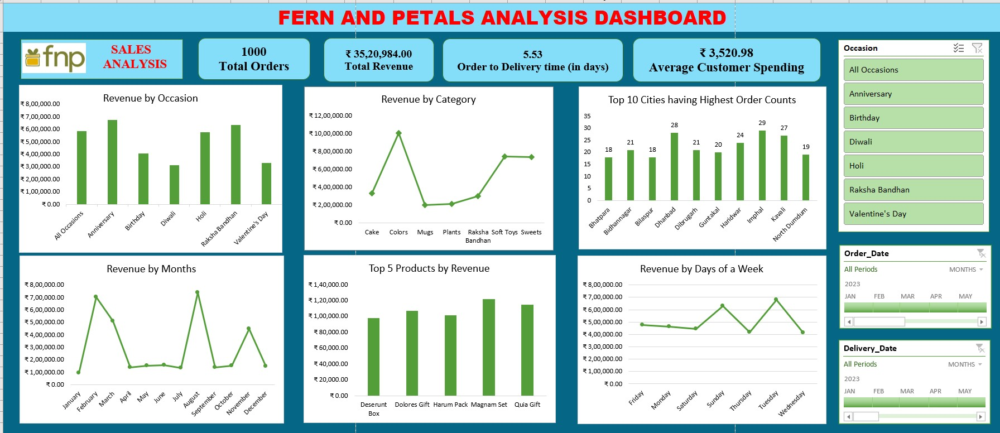

# 🌸 Ferns & Petals Sales Analysis | Excel

## 📌 Project Overview

This project analyzes sales data for **Ferns & Petals (FNP)**, a gifting business serving occasions such as Anniversaries, Birthdays, Diwali, Holi, Raksha Bandhan, and Valentine's Day.

Using **Microsoft Excel**, the project explores sales trends, customer spending, product performance, geographical demand, occasion-based revenue, and delivery performance.

The analysis is presented through a business-focused Excel dashboard designed to transform transactional data into clear and actionable insights.

---

## 🎯 Business Objective

The objective of this project is to analyze FNP sales data and answer key business questions that can support sales strategy and customer satisfaction.

The analysis focuses on:

- Overall revenue performance
- Average order-to-delivery time
- Monthly sales trends
- Top-performing products
- Average customer spending
- Top cities by order volume
- Relationship between order quantity and delivery time
- Revenue generated across different occasions
- Product popularity across occasions
- Opportunities for improving sales performance

---

## 📊 Key Performance Indicators

| KPI | Result |
|---|---:|
| **Total Orders** | **1,000** |
| **Total Revenue** | **₹35,20,984** |
| **Average Order-to-Delivery Time** | **5.53 Days** |
| **Average Customer Spending** | **₹3,520.98** |

---

## 🛠️ Tools & Techniques

| Tool / Technique | Purpose |
|---|---|
| **Microsoft Excel** | Data analysis and dashboard development |
| **Power Query** | Data cleaning and transformation |
| **Pivot Tables** | Data summarization and business analysis |
| **Pivot Charts** | Visualizing business trends |
| **Slicers** | Interactive dashboard filtering |
| **Excel Functions** | Supporting calculations and analysis |

---

## 🔄 Analysis Workflow

```text
Customers + Orders + Products
            ↓
      Data Preparation
            ↓
    Data Transformation
            ↓
       Data Analysis
            ↓
       Pivot Tables
            ↓
      Excel Dashboard
            ↓
     Business Insights
```

---

## 🔍 Business Analysis

### 💰 Overall Business Performance

The dataset contains **1,000 orders** generating total revenue of approximately **₹35.21 lakh**.

Average customer spending is approximately **₹3,520.98 per order**, while the average time between an order and its delivery is approximately **5.53 days**.

### 📅 Monthly Sales Performance

Sales fluctuate considerably throughout the year.

The strongest revenue months include:

- **August — ₹7,37,389**
- **February — ₹7,04,509**
- **March — ₹5,11,823**
- **November — ₹4,49,169**

These patterns indicate that demand is strongly influenced by seasonal and occasion-based purchasing.

### 🎁 Occasion Analysis

Revenue generated across major occasions includes:

| Occasion | Revenue |
|---|---:|
| **Anniversary** | **₹6,74,634** |
| **Raksha Bandhan** | **₹6,31,585** |
| **Holi** | **₹5,74,682** |
| **Birthday** | **₹4,08,194** |
| **Valentine's Day** | **₹3,31,930** |
| **Diwali** | **₹3,13,783** |

**Anniversary** generated the highest revenue among the occasions analyzed.

### 🏆 Top Products by Revenue

The five leading products generated a combined revenue of **₹5,42,226**.

| Product | Revenue |
|---|---:|
| **Magnam Set** | **₹1,21,905** |
| **Quia Gift** | **₹1,14,476** |
| **Dolores Gift** | **₹1,06,624** |
| **Harum Pack** | **₹1,01,556** |
| **Deserunt Box** | **₹97,665** |

**Magnam Set** was the highest revenue-generating product among the Top 5.

### 🌆 Geographic Demand

The analysis identifies several cities with relatively high order volumes.

Among the cities shown in the Top 10 analysis:

- **Imphal — 29 orders**
- **Dhanbad — 28 orders**
- **Kavali — 27 orders**
- **Haridwar — 24 orders**
- **Bidhan Nagar — 21 orders**
- **Dibrugarh — 21 orders**

These locations can help identify geographical areas with stronger customer demand.

### 🚚 Order Quantity vs. Delivery Time

The calculated correlation between **order quantity and delivery time is approximately 0.0035**.

This value is extremely close to zero, indicating that the analysis found **essentially no linear relationship between order quantity and delivery time** in this dataset.

In other words, larger order quantities did not appear to systematically increase delivery times.

---

## 💡 Key Business Insights

- **Anniversary** is the highest revenue-generating occasion.
- **Raksha Bandhan and Holi** are also important revenue-generating occasions.
- **August and February** are the two strongest revenue months.
- **Magnam Set** is the highest revenue-generating product among the Top 5 products.
- **Imphal** records the highest order count among the cities included in the Top 10 analysis.
- **Cake and Soft Toys** are identified as strong-performing product categories.
- **Colors, Mugs, and Plants** are identified as comparatively weaker categories.
- Order quantity shows almost **no linear relationship with delivery time**.
- Revenue varies considerably by month and occasion, indicating meaningful seasonal purchasing patterns.

---

## 📊 Excel Sales Dashboard



The dashboard brings together the major KPIs and analytical views into a single business-focused report.

It provides analysis across:

- Revenue
- Orders
- Customer spending
- Delivery performance
- Product categories
- Top products
- Cities
- Occasions
- Monthly trends
- Day-of-week performance

Interactive slicers were used to make the analysis easier to explore across relevant dimensions.

---

## 📈 Business Recommendations

Based on the analysis:

- Prioritize marketing campaigns around **Anniversaries, Raksha Bandhan, and Holi**, which are strong revenue-generating occasions.
- Ensure sufficient inventory for leading products such as **Magnam Set, Quia Gift, Dolores Gift, and Harum Pack** during high-demand periods.
- Prepare inventory and promotional campaigns ahead of strong revenue months such as **February and August**.
- Consider targeted campaigns and delivery planning for cities showing stronger order volumes, including **Imphal, Dhanbad, Kavali, and Haridwar**.
- Explore bundling or cross-selling weaker categories such as **Colors, Mugs, and Plants** with stronger-performing categories.
- Investigate opportunities for **Wednesday promotions**, as the analysis identifies Wednesday as the lowest-revenue day.
- Continue monitoring delivery performance, while recognizing that order quantity itself showed almost no linear relationship with delivery time in this dataset.

---

## 📂 Repository Structure

```text
ferns-and-petals-sales-analysis/
│
├── data/
│   ├── customers.csv
│   ├── orders.csv
│   └── products.csv
│
├── docs/
│   ├── business_analysis_answers.pdf
│   ├── business_insights.pdf
│   └── business_questions.pdf
│
├── images/
│   ├── fnp_logo.png
│   └── fnp_sales_dashboard.jpg
│
└── README.md
```

---

## 💼 Skills Demonstrated

- Microsoft Excel data analysis
- Data cleaning and transformation
- Pivot Tables and Pivot Charts
- Interactive dashboard development
- KPI development
- Sales trend analysis
- Customer spending analysis
- Product performance analysis
- Occasion-based analysis
- Geographic analysis
- Delivery performance analysis
- Correlation analysis
- Business insight generation
- Data storytelling

---

## ▶️ How to Explore the Project

1. Start with the dashboard image in **`images/fnp_sales_dashboard.jpg`** for a visual overview.
2. Explore the raw datasets inside the **`data/`** folder.
3. Review **`docs/business_questions.pdf`** to understand the business problems addressed.
4. Open **`docs/business_analysis_answers.pdf`** for the detailed analytical outputs.
5. Review **`docs/business_insights.pdf`** for the summarized business findings.

> **Note:** The original Excel workbook used to develop the dashboard is not included in this repository. The repository contains the source datasets, dashboard output, business questions, analytical results, and insights documentation.

---

## 👤 Author

**Sagar Gupta**  
Data Analyst | SQL • Power BI • Python • Excel

[LinkedIn](https://www.linkedin.com/in/sagar-gupta087/) • [Portfolio](https://sagar-gupta-data-analyst.framer.website/) • [GitHub](https://github.com/Sagar-Gupta008)

---

⭐ If you found this project useful, feel free to explore the repository and connect with me.
